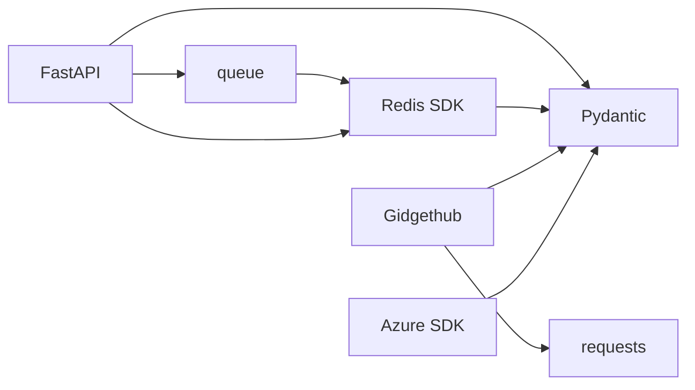
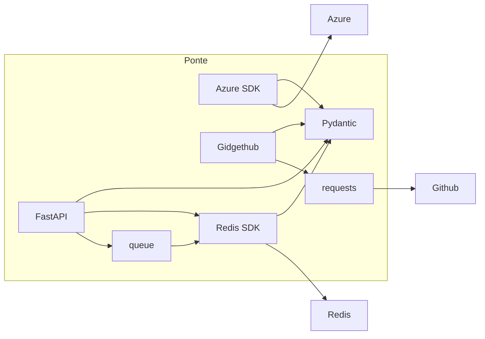

# Abhängigkeiten

Die Abhängigkeiten zwischen Ponte und anderen Endpunkten zu verstehen ist trivial und ermöglicht eine Übersicht über die verschiedenen Contracts die geformt werden müssen um auf gewünschte Events zu reagieren und diese bei der Anleitung deklarieren zu können. Eine Github App muss bereitgestellt werden um der Applikation Webhooks anzubinden. Die Datenbank muss beim Deployment bereitgestelt sein oder zumindest mitausgeführt werden in irgendeiner Form. Eine Art sich gegen Azure und seiner API zu authentifizieren und ein Deployment auszuführen.

Entscheidet man sich für eine SDK um mit einer API zu interagieren, muss auch diese Abhängigkeit auf Sicherheitslücken geprüft und wenn möglich mit einem Update auf einen stabilen Stand bringen und sich den SDK Änderungen bewusst sein um allenfalls Refactoring in den Lifecycle der Weiterentwicklung der Applikation mit hineinbeziehen.

Die folgenden Abhängigkeiten wurden festgestellt und entsprechend mit einem Tool, Framework oder einer Library abgedeckt und können im requirements.txt von Repo entnommen werden:

- Azure SDK für Python mit Authentication Library
- Redis
- pydantic
- gidgethub
- container image

## Übersicht

Anhand der Darstellung ist ein Abhängigkeitenbaum ersichtlich wie die Abhängigkeiten miteinander interagieren. Pydantic verbindet viele Teile wie die Azure SDK, Redis und weitere. Um den Lifecycle von Ponte auch für Day 2 Operations zu gliedern, versuchen wir Abhängigkeiten welche von vielen Modulen konsumiert werden von anfang an als kritisch zu hinterlegen und können eine geeignete CI Strategie anwenden. 

Mit Monitoring Tools wie Dynatrace können wir auf Containerebene die Applikation monitoren und mit Trivy generelle Security Scans auf das Container Image werfen bevor das Image über eine CD Pipeline den Weg in die Ausführungsebene führen kann. Bei einem Upgrade von Dependencies wenn Sicherheitstechnisch notwendig, wird nach Einstufung der semantischen Version angegagangen:

- Major Releases werden vorerst durch das Team in einem Daily oder Weekly besprochen. Der Aufwand wird identifiziert und wenn kritisch in ein priorisiertes Backlog geworfen
- Minor Releases solange Feature nicht relevant kann für ein Patch Window addressiert werden.
- Bugfixes werden immer angewandt um potenziellen Fehlern vorzubeugen

## Systeme

Die beiden externen Systeme 

## Azure SDK

Die Azure SDK ist ein modulares System von packages für die verschiedenen API Offerings Azure beinhaltet. Bei go ist zum Beispiel der gesamte Terraform AzureRM Provider mit der Azure SDK geschrieben worden. Die Azure SDK bietet Möglichkeiten zur Authentifizierung die mit ihrer gesamten Entra ID Palette unterstützt wird. Das heisst klassiche Service Principals für client secret authentication, managed identities (system-assigned und user-assigned), mit Zertifikaten, etc. out of the Box.

Zudem erweitert man die Nutzung der SDK mit den entsprechenden Modulen für Netzwerke, VMs und weitere Komponenten die in Azure zur Verfügung gestellt werden. 

Die Dokumentation für die Azure SDK bietet API Dokus für die verschiedenen Komponenten die eine ganze Resource abbilden und bietet eine gute Übersicht über alle Klassen. Die Übersicht der Dokumentation aller Module findet man [hier](https://learn.microsoft.com/en-us/python/api/overview/azure/?view=azure-python).

### Impact

Die Authentication Library ist Dreh und Angelpunkt für die sichere Authentifizierung als Teil einer Identität in der Infrastruktur. 

### Folge

Darum muss vorallem auf Änderungen in der API geachtet werden und natürlich bei Vulnerabilities die Release erweitern. Durch Image Scans in der Container Registry und Dependabot als Alternative für die schnelle Verwaltung der Abhängigkeit mit einer Review Phase starten. So können Deprecation Notices früh gefangen werden und wenn nötig gehandelt werden

## Redis

Redis bietet eine SDK zur Handlung von Operationen auf Redisdatenbanken. Redis hat einen guten Ruf rückwärtskompatibilität zu bieten und stattdesen durch Feature Releases die Funktionalität erweitern oder mit ihrer integrierten Cloud Plattform einem mehr Übersicht und Features zu verwenden, welches die Operation mehrer Datenbanken fördern könnte. Wenn man aber das benötigte Feature Set sieht welches momentan für Ponte verwendet wird, wird klar dass mit der gewohnten Standardbibliothek genug erreichbar ist. Das patchen der Datenbank gehört wie immer dazu und solange die SDK keine kritischen oder hohen known Vulnerabilities bei den eigenen Abhängigkeiten aufweist ist der Handlungsbedarf gering. 

### Impact

Die SDK für Redis kann stellt keinen erhöhten Handlungsbedarf bei der Weiterverwendung während des üblichen Lifecycles der Applikation.

## Pydantic

Pydantic dient bei verschiedenen Operationen mit verschiedenen SDKs eine wesentliche Rolle in der Validierung und Darstellung von Daten in Ponte. Pydantic hat sich seit der Entstehung weiterentwickelt und mit der Zeit Breaking Changes eingeführt. Diese Veränderungen sind Community getrieben und können Einfluss auf die Verwendung von pydantic in anderen Versionen der Iteration bringen. Somit muss wenn möglich lange auf `Minor` Releases gesetzt werden und Major Releases immer bei einem Upgrade evaluiert werden, da verschiedene Komponenten über Pydantic ein einheitliches Datenmodel anbietet.

### Impact

Bei einem Breaking Change muss Zeit in Refactorings und evtl. Schema Anpassungen gemacht werden. Dies könnte Impact auf das Nutzererlebnis haben oder auf die Umsetzung der Aufgaben die Ponte verrichtet.

Der Aufwand könnte mit mehr Code immer mehr steigen.

## Gidgethub

Gidgethub ist ein leichter Wrapper um die Github API um Requests als Github app einfacher zu bewältigen. Die Community ist noch an der Entwicklung beteiligt und Features werden nur bei Bedarf erweitert. Was gut ist um nicht unnötige Breaking Changes in die Prozedur mithineinzubrungen. Dies ist natürlich auf Die stabile API von Github zu setzen, da dies den Aufwand von Gidgethub erschwierigen würde.

## Impact

Gidgethub hat grossen Einsatz bei vielen und bei Ponte ist die API der Kommunikation mit dem Nutzer. Ihre stabilen Release kann als positiv betrachtet werden und der Impact ist durch die Seite von Github abhängig so wie es bei vielen Community SDKs ist. 

### Folge

Benachrichtigungen über mögliche API Changes seitens Github müssen realisiert werden. So können auf Changes frühzeitig reagiert werden.

## Container Image

Beim Container Image muss vorallem eine Überblick über die Vulnerabilities des Basis Images geachtet werden. Eine automatische Image Erneuerung mit einem neuen Tag Release für das alpine Image sollte reichen, wenn die Vulnerabilities wöchentlich assessed werden. 

### Impact

Wie bei jedem Container Image sind die Menge an Tools im Basisimage und der Code der Ausgeführt dreh und Angelpunkt fürs Deployment. Die Image Releases müssen wenn möglich automatisiert bereitgestellt werden um Vulnerabilities des Images zu bereinigen. Die Vulnerabilities von Ponte gehören in eine CI Release Pipeline für die Weiterentwicklung der Applikation.
